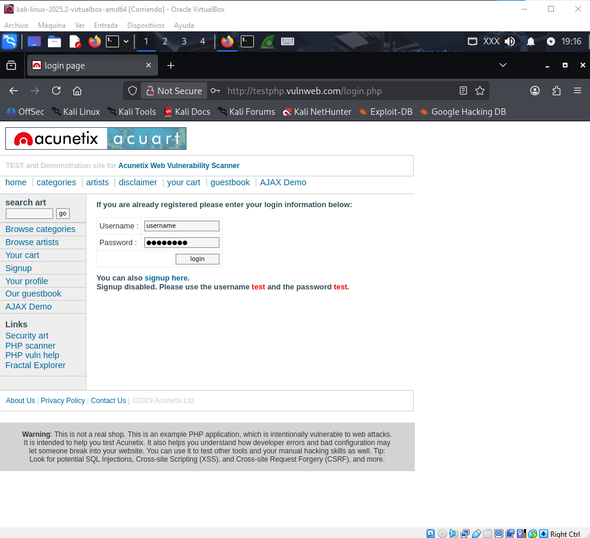
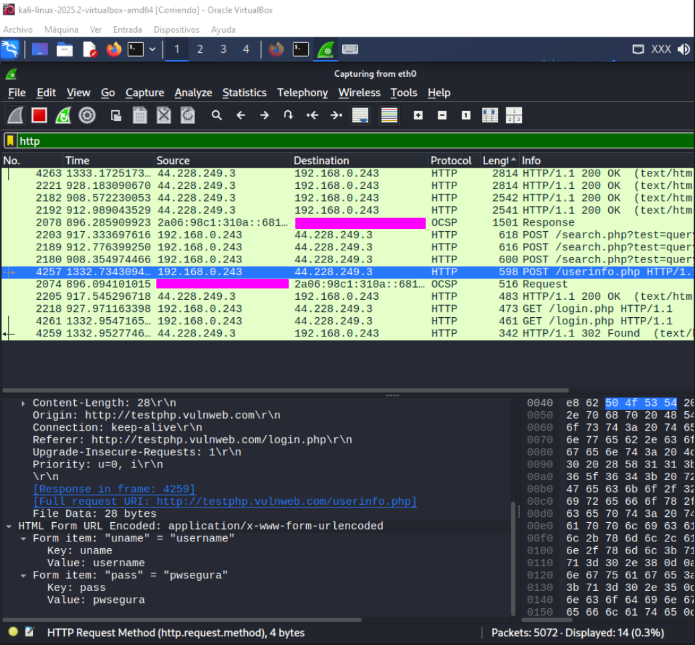
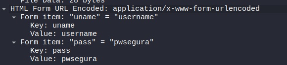

# PoC: Análisis de Tráfico y Riesgos por Falta de Cifrado (HTTP vs. HTTPS)

Durante la fase inicial de análisis se evaluó el comportamiento de servicios web que operan sin el protocolo SSL/TLS (Secure Sockets Layer / Transport Layer Security).

## 1. Contexto Teórico y Riesgo
* **Problemática:** Los sitios web que no implementan HTTPS transmiten credenciales y datos sensibles en texto plano.
* **Vector de Riesgo:** Un atacante situado en el mismo segmento de red (Man-in-the-Middle) puede capturar paquetes utilizando herramientas de análisis de red como **Wireshark**.

---

## 2. Prueba de Concepto (PoC)

### Paso 1: Escenario de Prueba (Aplicación Web Objetivo)
Se accedió a un formulario de autenticación expuesto sobre el protocolo HTTP no cifrado (`http://testphp.vulnweb.com/login.php`) y se rellenaron los inputs de credenciales (usuario y contraseña)

*Interfaz web de inicio de sesión operando sin certificado SSL/TLS (Not Secure).*

### Paso 2: Intercepción de Tráfico y Captura de Credenciales
Se inició el sniffer de red filtrando la interfaz por el protocolo `http`. Tras enviar el formulario de inicio de sesión, se identificó la petición `POST /userinfo.php`. 

Al desplegar la sección **HTML Form URL Encoded**, se constató la exposición directa de las credenciales introducidas.

*Captura de tráfico en Wireshark revelando los campos de autenticación en texto plano.*

*Detalle del payload recibido (`uname: username` / `pass: pwsegura`).*

---

## 3. Impacto y Mitigación

### Impacto
La ausencia de cifrado TLS expone las sesiones de los usuarios a ataques de intercepción (*eavesdropping*), permitiendo el robo de identidades y credenciales en redes locales o públicas.

### Mitigación
1. **Implementación de SSL/TLS (HTTPS):** Configurar certificados válidos (ej. mediante *Let's Encrypt*) para forzar el canal cifrado TLS 1.2+.
2. **Cabecera HSTS (HTTP Strict Transport Security):** Garantizar que los navegadores solo se conecten a la versión HTTPS de la aplicación.
3. **Uso de VPNs:** Canalizar el tráfico a través de un túnel cifrado en redes de acceso público o no confiables.