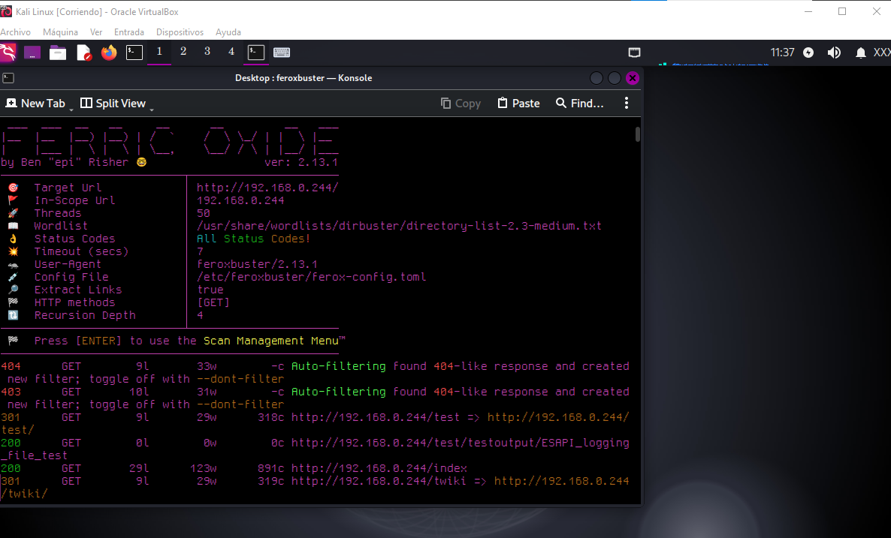
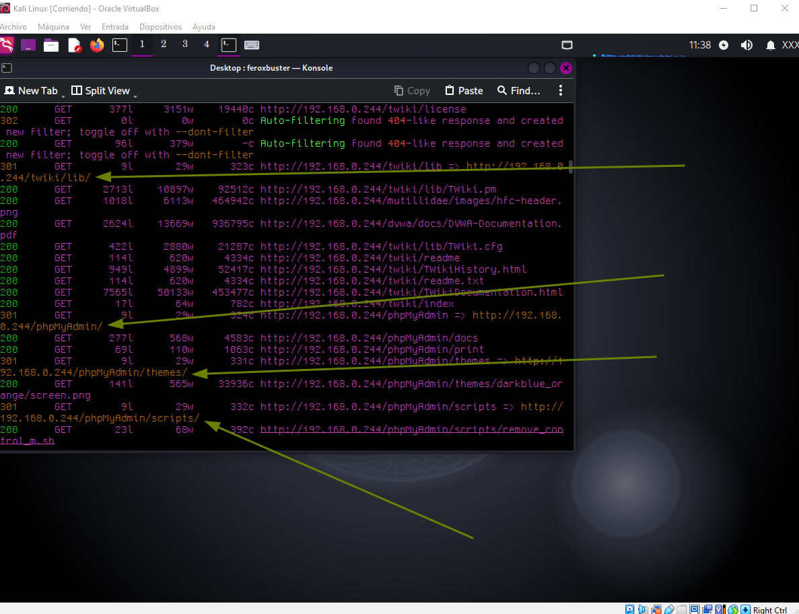
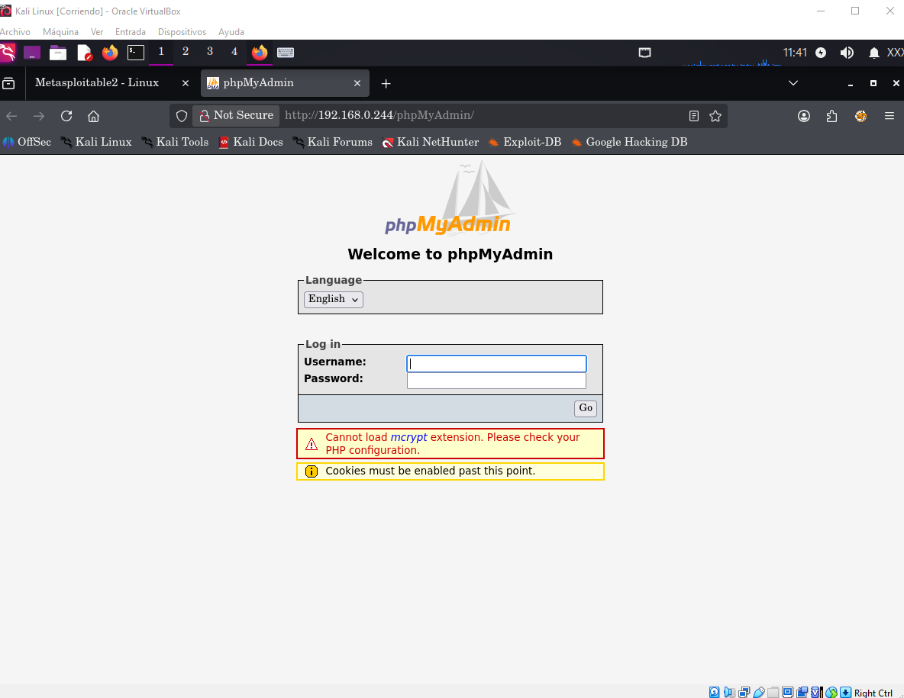

# Fuzzing y Enumeración Web con Feroxbuster

## 1. Objetivo
Demostrar la capacidad de realizar descubrimiento activo de recursos, directorios no indexados y archivos ocultos en servidores web utilizando la herramienta **Feroxbuster**.

---

## 2. Ejecución Técnica

```bash
feroxbuster -u http://<IP_OBJETIVO> -w /usr/share/wordlists/dirbuster/directory-list-2.3-medium.txt -t 50
```

### Análisis del Comando

- `-u`: URL del objetivo a auditar.
    
- `-w`: Diccionario de nombres de directorios/archivos para la fuerza bruta.
    
- `-t`: Número de hilos concurrentes para optimizar la velocidad del escaneo.


*Banner e inicio de la ejecución del escaneo en Feroxbuster.*


*Identificación de rutas críticas y códigos de respuesta HTTP (200 OK, 301 Redirect) como `/phpMyAdmin/` y `/twiki/`.

## 3. Validación de Hallazgos

Una vez completada la fase de enumeración, se realizó la verificación manual en el navegador para confirmar la accesibilidad y el estado de los recursos descubiertos.



*Confirmación visual del panel de gestión `phpMyAdmin` expuesto.

## 4. Impacto y Mitigación

### Impacto

La exposición indeseada de rutas administrativas o paneles de gestión (`/phpMyAdmin`, `/twiki/`) amplía la superficie de ataque, permitiendo a un tercero intentar vectores de fuerza bruta, autenticación por defecto o explotación de vulnerabilidades conocidas en dichos componentes.

### Mitigación

1. **Control de Acceso:** Restringir el acceso a interfaces administrativas mediante reglas de firewall o listas de control de acceso (ACL) por IP.
    
2. **Hardening de Servidor Web:** Deshabilitar el indexado de directorios sensibles y renombrar o proteger endpoints críticos detrás de una red privada/VPN.


