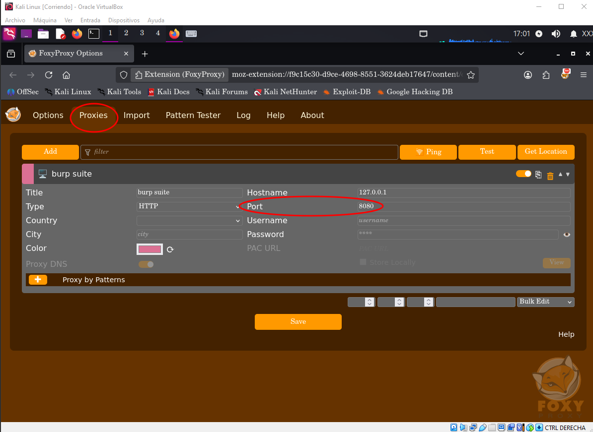
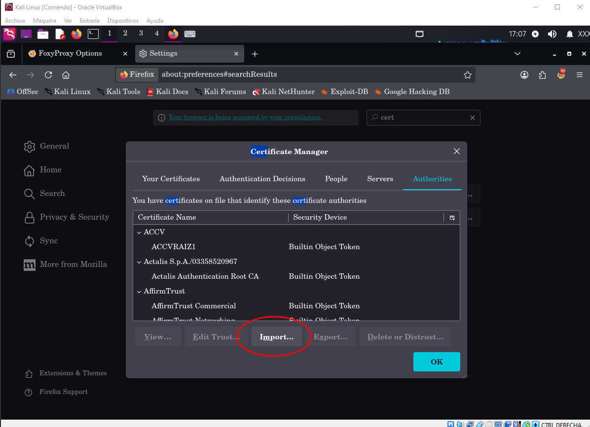
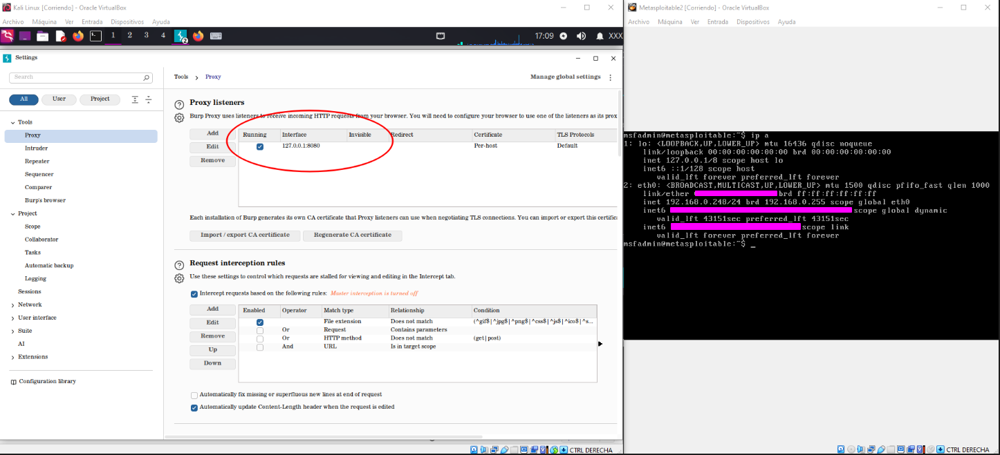
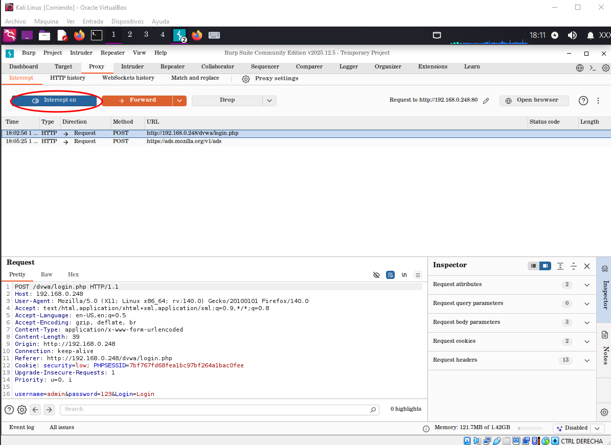
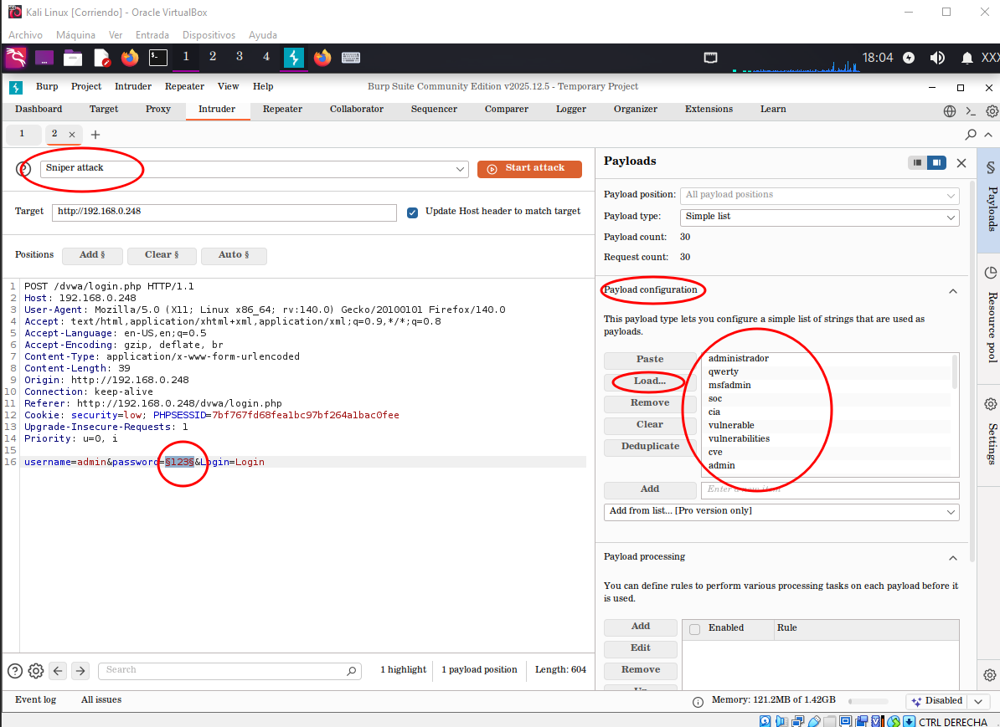
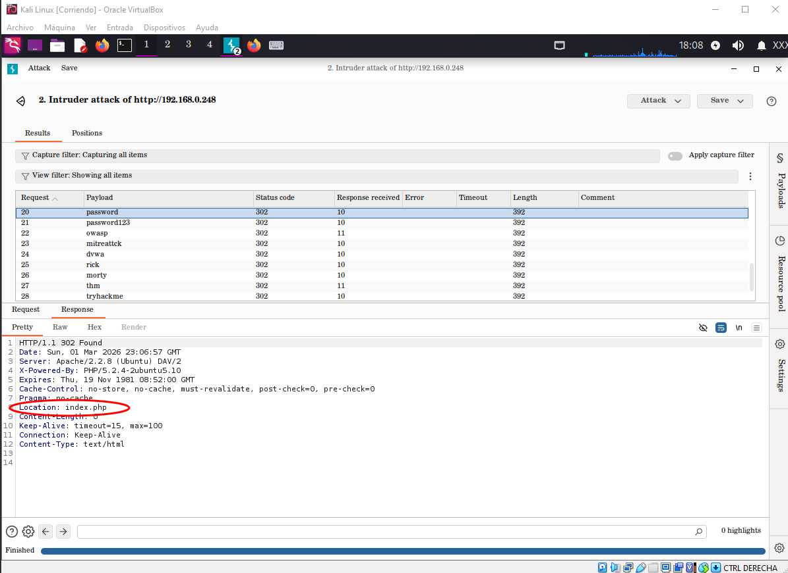
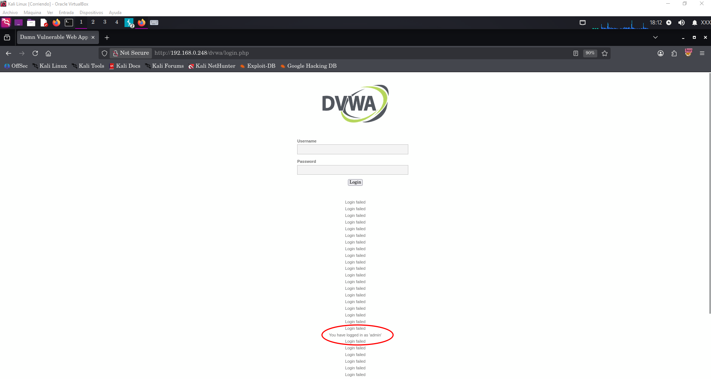

# Intercepción de Peticiones y Ataque de Diccionario (Burp Suite)

## 1. Objetivo Técnico
El propósito de este procedimiento es configurar un entorno controlado de intercepción de tráfico HTTP/HTTPS mediante un proxy local y la instalación de un certificado CA de confianza. Sobre esta infraestructura se desarrolla una **Prueba de Concepto (PoC)** de ataque de diccionario contra el formulario de autenticación de la plataforma **DVWA (Damn Vulnerable Web Application)** empleando el módulo `Burp Suite Intruder`.

---

## 2. Configuración e Infraestructura de Intercepción

### 2.1. Enrutamiento del Tráfico de Red (FoxyProxy)
Se configuró el complemento **FoxyProxy Standard** en el navegador Mozilla Firefox para canalizar de forma selectiva las solicitudes web hacia el socket local del proxy interceptor (`127.0.0.1:8080`).

*Redirección del tráfico web cliente hacia el puerto local 8080.*

### 2.2. Establecimiento de Confianza SSL/TLS (Certificado Raíz)
Para realizar el análisis de tráfico cifrado sin generar advertencias de seguridad ni interrupción de handshake TLS en el navegador, se exportó e importó la Entidad Certificadora raíz (`PortSwigger CA`) en la tienda de certificados del navegador.

*Figura 2: Importación e instalación del certificado raíz de Burp Suite en Firefox.*

### 2.3. Verificación del Proxy Listener
Se constató que el servicio Proxy de Burp Suite se encontrase activo y escuchando peticiones entrantes sobre la interfaz de bucle de retorno local.

*Confirmación de escucha activa del servicio Proxy en 127.0.0.1:8080.*

---

## 3. Ejecución de la Prueba de Concepto (PoC)

### Paso 1: Intercepción de la Petición de Autenticación
Con el modo **Intercept ON** habilitado, se transmitió un intento de inicio de sesión en DVWA (`http://192.168.0.248/dvwa/login.php`). Burp Suite capturó la solicitud HTTP de tipo `POST`, exponiendo las credenciales transmitidas en texto plano dentro del cuerpo de la petición.

*Captura de la petición POST transmitida a /dvwa/login.php conteniendo parámetros de login en texto plano.*

### Paso 2: Definición de Posiciones y Carga de Payloads en Intruder
La solicitud interceptada se envió al módulo **Intruder** (`Ctrl + I`). Se configuró el modo de ataque **Sniper**, marcando como posición dinámica única el parámetro `password` (`§123§`). Posteriormente, en la pestaña *Payloads*, se cargó el diccionario de contraseñas de prueba.

*Delimitación del parámetro objetivo (§123§) y carga del listado de credenciales en Payload Configuration.*

### Paso 3: Ejecución del Ataque y Análisis de Respuestas HTTP
Al ejecutar el ataque, se monitorearon las respuestas emitidas por el servidor web ante cada intento del diccionario:
* **Peticiones fallidas:** Devolvieron un código de estado `200 OK` o mantuvieron la respuesta estándar del formulario.
* **Petición exitosa:** El payload válido (`password`) provocó una respuesta `HTTP 302 Found` acompañada del encabezado `Location: index.php`, demostrando la validación correcta de credenciales y la redirección hacia la sesión autenticada.

*Resultados del ataque Sniper con identificación de la clave correcta mediante código 302 y redirección a index.php.*

### Paso 4: Verificación de la Sesión Concedida
Tras desactivar la intercepción de tráfico en Burp Suite, se verificó en el navegador cliente la obtención del token de sesión y el acceso concedido con el rol de usuario `admin` en el panel principal de DVWA.

*Confirmación visual del acceso autenticado en el panel de DVWA tras la automatización exitosa.*

---

## 4. Evaluación de Riesgo y Medidas de Mitigación

| Vulnerabilidad / Vector           | Impacto Identificado                                                                                | Recomendación de Mitigación                                                                  |
| :-------------------------------- | :-------------------------------------------------------------------------------------------------- | :------------------------------------------------------------------------------------------- |
| **Ausencia de Account Lockout**   | Permite realizar un número ilimitado de intentos automatizados sin bloqueos ni retardos por tiempo. | Implementar bloqueos temporales de cuenta o IP tras 3 a 5 intentos fallidos consecutivos.    |
| **Falta de Desafíos CAPTCHA**     | Facilita la ejecución de scripts y herramientas automatizadas (como Burp Intruder, Hydra, etc.).    | Integrar mecanismos de validación humana (ej. reCAPTCHA o hCaptcha) en formularios críticos. |
| **Autenticación de Factor Único** | Un compromiso de contraseña otorga control total de la cuenta.                                      | Habilitar Autenticación Multi-Factor (MFA / 2FA) obligatoria para usuarios administradores.  |
