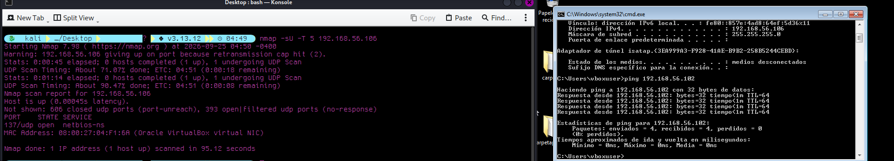
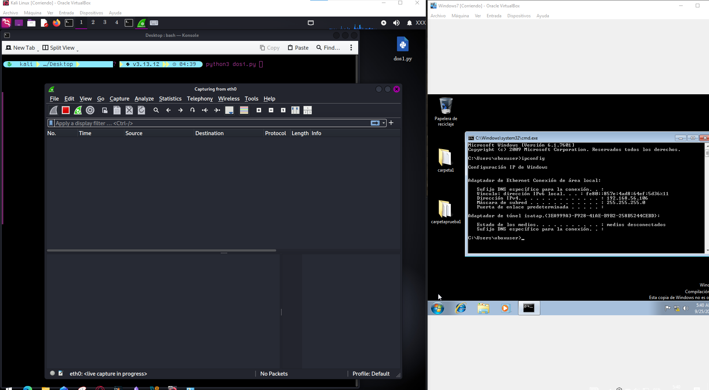
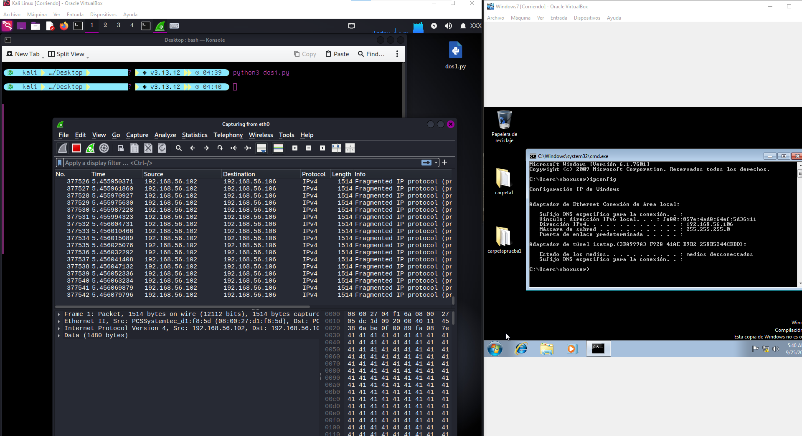

# Prueba de Concepto y Reporte: Análisis de Tráfico y Simulación de UDP Flood

## 1. Resumen
Este documento detalla la simulación y el análisis de una prueba de inundación de paquetes UDP (*UDP Flooding*) sobre una máquina objetivo con Windows 7 en un entorno de laboratorio controlado.

El objetivo principal de esta prueba fue llevar a la práctica conceptos teóricos sobre comunicación de redes y protocolos (modelo OSI, capa de transporte UDP), comprender la mecánica de los ataques de *flooding* y evaluar la respuesta del sistema ante la llegada masiva y continua de paquetes UDP no solicitados.

---

## 2. Entorno del Laboratorio
El laboratorio se desplegó en un segmento de red aislado **Host-Only** de Oracle VirtualBox para garantizar que el tráfico malicioso no saliera de la máquina anfitriona ni afectara redes externas.

| Función      | Sistema Operativo | Dirección IP     |
| :----------- | :---------------- | :--------------- |
| **Atacante** | Kali Linux        | `192.168.56.102` |
| **Objetivo** | Windows 7         | `192.168.56.106` |

> **Captura 1: Configuración de red del laboratorio (ifconfig / ipconfig)**
> 

---

## 3. Metodología y Fase de Ejecución

### Fase 1: Reconocimiento (Nmap)
Antes de realizar la prueba de envío de tráfico, se ejecutó un escaneo sobre la IP objetivo para identificar un puerto UDP abierto con un servicio alojado:

```bash
nmap -sU -T 5 192.168.56.106
```


- **Observación:** Se utilizó `-sU` para auditar la capa de transporte UDP y `-T5` para acelerar los tiempos del escaneo en la red local virtual.

- **Resultado:** Se identificó activo el puerto **UDP 137** alojando el servicio NetBIOS Name Service, seleccionado como el objetivo para la prueba.


### Fase 2: Explotación y Generación de Tráfico (`dos1.py`)

Con el apoyo de modelos de Inteligencia Artificial para el armado y estructuración de la lógica del código, se desarrolló y personalizó un script en Python (`dos1.py`). El script utiliza _sockets_ de bajo nivel para transmitir cargas masivas de datos hacia el puerto objetivo (IP `192.168.56.106`, Puerto `137`).

> 

### Fase 3: Captura y Análisis (Wireshark)

Se utilizó Wireshark escuchando en la interfaz `eth0` de la máquina atacante (Kali) para analizar el comportamiento de la red durante el ataque:

> 

- **Patrón de Tráfico:** Inundación constante de datagramas enviada desde la IP `192.168.56.102` hacia `192.168.56.106`.

- **Fragmentación de Paquetes:** Wireshark registró paquetes marcados como `Fragmented IP protocol` debido a que el tamaño de los datagramas excedió el MTU (unidad máxima de transmisión) de la red, obligando al sistema a procesar fragmentos de 1514 bytes.

- **Payload:** Relleno repetitivo de bytes en formato hexadecimal (`41 41 41...`, correspondiente a la letra `'A'` en ASCII).


## 4. Impacto y Riesgo Asociado

- **Vector de Ataque:** Inundación UDP (_UDP Flood_) / Exhaustación de recursos de red.

- **Impacto:** Degradación del ancho de banda disponible, alto procesamiento por parte de la pila TCP/IP del objetivo para reensamblar paquetes fragmentados y potencial denegación de servicio para otros servicios alojados en el host.

- **Criticidad:** **Media-Alta** en entornos internos no segmentados o sin reglas de firewall activas.


## 5. Medidas de Remediación y Mitigación

### A. Configuración de Firewall y Limitación de Tasa (_Rate Limiting_)

1. **Filtrado de Puertos Innecesarios:** Cerrar o deshabilitar servicios no requeridos a nivel de host o firewall. En este caso, deshabilitar NetBIOS (puerto UDP 137) si no es estrictamente necesario en la red local.

2. **Limitación de Velocidad (_Rate Limiting_):** Aplicar reglas en el firewall perimetral o local para restringir la cantidad permitida de paquetes UDP procesados por segundo desde un mismo origen.


### B. Endurecimiento del Sistema Operativo (_OS Hardening_)

1. **Actualización del SO:** Windows 7 es un sistema operativo fuera de soporte. Se recomienda la migración a sistemas modernos (Windows 11 o Windows Server 2022), los cuales cuentan con protecciones nativas mejoradas en la pila TCP/IP.

2. **Rechazo de paquetes anómalos:** Configurar las políticas del sistema operativo para descartar fragmentos IP malformados o no solicitados.


### C. Mecanismos Anti-DDoS

1. **Sistemas IDS/IPS:** Implementar herramientas de detección/prevención de intrusiones como **Suricata** para alertar o bloquear firmas de inundación de tráfico en tiempo real.

## 6. Descargo de Responsabilidad (Disclaimer)

> **Atención:** Este proyecto y el código asociado fueron desarrollados con fines exclusivamente educativos y de aprendizaje personal en un entorno de laboratorio aislado. El uso de estas técnicas en redes sin autorización previa y explícita está prohibido y constituye un delito informático.